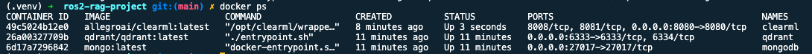
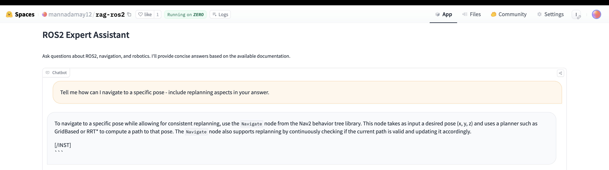
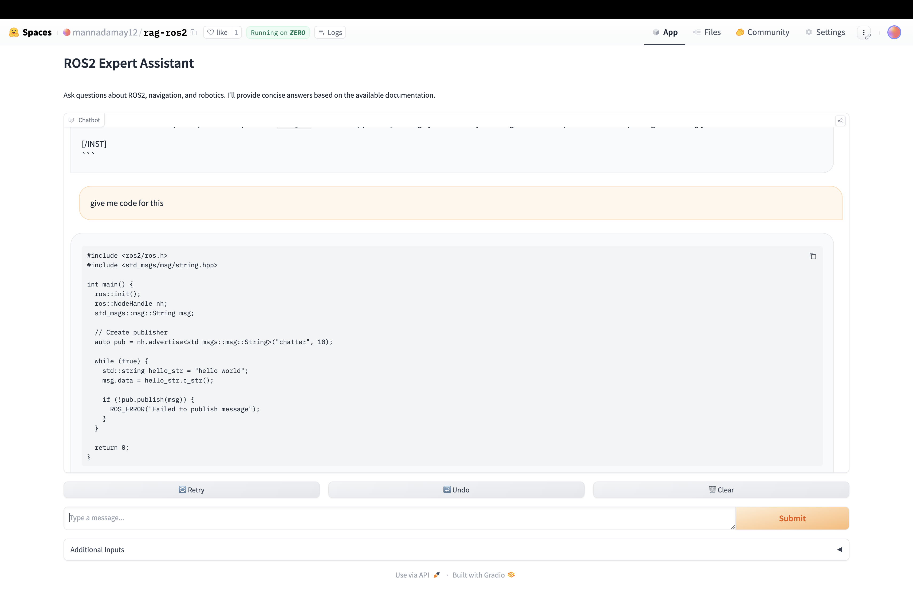
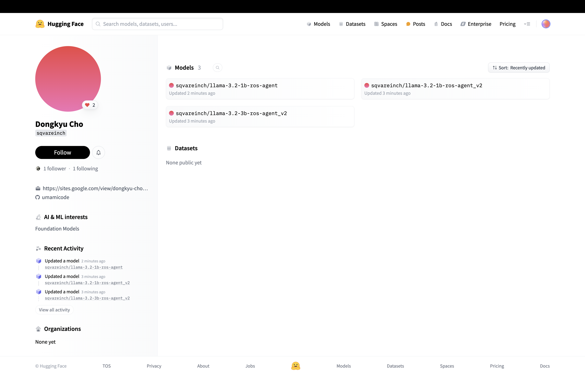

# ROS2 RAG System

Test the RAG here: [Application-rag-ros2](https://huggingface.co/spaces/mannadamay12/rag-ros2)

## Environment Setup

1. This project uses Docker Compose to set up the development environment.
2. Virutal env and requirements can be pulled in to run locally
```
python3.9 -m venv rag-venv
pip install -r requirements.txt
```

### Prerequisites
- Docker
- Docker Compose

### Running the project
1. Clone this repository
2. Navigate to the project directory
3. Run `docker-compose up --build`

### Services
- App: Main application
- MongoDB: Database for storing RAG raw data
- Qdrant: Vector search engine
- ClearML: Orchestrator and experiment tracking system

### Docker ps


### Example prompts as per project description



### Model Cards (fine-tuned) on hugging face



### Team IDs
- GitHub IDs: [mannadamay12](https://github.com/mannadamay12), [umamicode](https://github.com/umamicode)
- HuggingFace IDs: [mannadamay12](https://huggingface.co/mannadamay12), [sqvareinch](https://huggingface.co/sqvareinch)

### Milestone 1
1. Scraping of documentation urls for ros2, nav2, moveit2, gazeob
2. Getting GitHub repos(although everything is covered in documention) and youtube tutorial transcripts
3. Mongodb store for database collection of variuos documents
4. Clear orchestration using clearml tasks and pipelines to track progress of ingestion
5. Base crawler and scraper to extract data from provided `sources.yaml`

