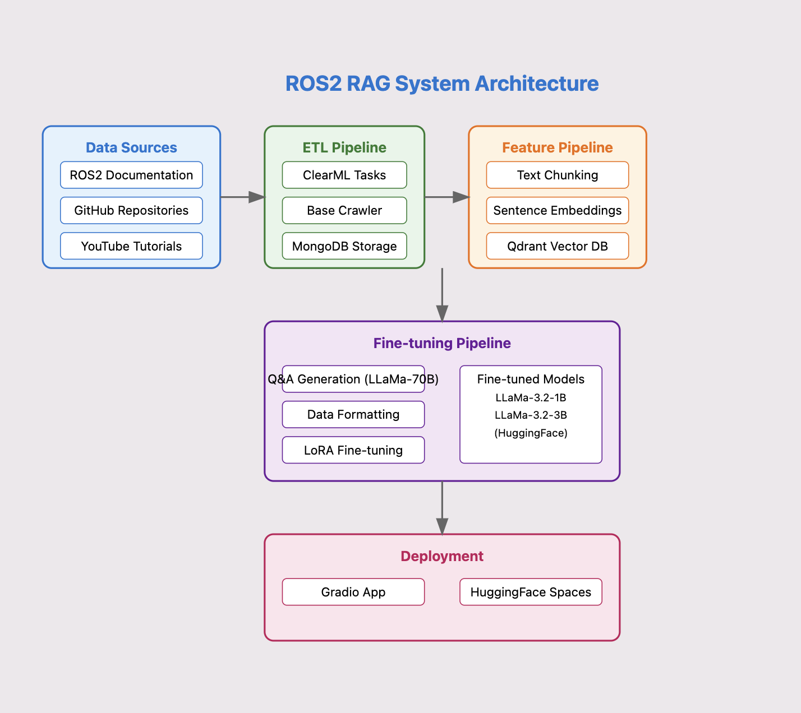

# ROS2 RAG System

A Retrieval Augmented Generation (RAG) system designed to assist ROS2 robotics developers with navigation stack development. The system provides specific answers and code examples for robotics development queries across ros2, nav2, moveit2, and gazebo subdomains. [Application-rag-ros2](https://huggingface.co/spaces/mannadamay12/rag-ros2)


## Features
- Multi-source data ingestion (documentation, GitHub, tutorials)
- Vector similarity search for relevant context retrieval
- Fine-tuned language models available on HuggingFace
- Interactive query interface with pre-populated robotics questions
- Docker containerization for easy deployment

## Environment Setup

1. This project uses Docker Compose to set up the development environment.
2. Virutal env and requirements can be pulled in to run locally
```
python3.9 -m venv rag-venv
pip install -r requirements.txt
```

### Prerequisites
- Docker
- Docker Compose

### Running the project
1. Clone this repository
2. Navigate to the project directory
3. Run `docker-compose up --build`

### Services
- App: Main application
- MongoDB: Database for storing RAG raw data
- Qdrant: Vector search engine
- ClearML: Orchestrator and experiment tracking system

### Docker ps


### Model Cards (fine-tuned) on hugging face


## Data Collection Milestone
1. Scraping of documentation urls for ros2, nav2, moveit2, gazeob
2. Getting GitHub repos(although everything is covered in documention) and youtube tutorial transcripts
3. Mongodb store for database collection of variuos documents
4. Clear orchestration using clearml tasks and pipelines to track progress of ingestion
5. Base crawler and scraper to extract data from provided `sources.yaml`


## Featurization Pipelines Milestone
1. Vector database creation using qdrant.
2. Use sentence transformers to create chunks and store the vector database in qdrant client.
3. Simulataneously mark in mongodb collections if the current document has been feature extracted.
4. Use clearml orchestrator to track progress.
> 🤖 Please have a look at *'notebooks/04_llama_rag.ipynb'* for a detailed understanding of this section.

After the data is prepared, we implemented a vectorDB using [Chroma](https://www.trychroma.com/) and [Qdrant](https://qdrant.tech/). For our pipeline, we used Chroma owing to its customization features.

For featurization, we used the pre-trained [<hkunlp/instructor-base>](https://huggingface.co/hkunlp/instructor-base) model as the embedding model. Using the embedding model, we featurized the documents and launched a Chroma database for later use. At this point, the RAG system is ready for use. 


***
## Finetuning Milestone

For the fine-tuning milestone, we have focused on two sub-objectives. 

1. Generate Fine-tuning Data using Large Language Models

2. Parameter-efficient Fine-tuning with limited GPU resources. 

### 1. Generate Fine-tuning Data using Large Language Models
> 🤖 Please refer to  *'notebooks/02_finetuning_data_generation .ipynb'* for a detailed understanding of how we augmented data using LLMs.

Our fine-tuning data, consists of 1500+ pairs of question-answer pairs generated from the Ros2 documentation. In specific, we used a pre-trained LLM (e.g., LLama-3.1-70B) to select informative Q&A pairs. 

Below are samples of the Q&A pairs we have generated.
```
{'question': 'What is the recommended prerequisite for installing the webots_ros2 package?', 'answer': 'Understanding basic ROS principles covered in the beginner Tutorials, particularly Creating a workspace and Creating a package.'}, 
{'question': 'How do you install the webots_ros2 package from the latest up-to-date sources from Github?', 'answer': 'By running the command "git clone --recurse-submodules src/webots_ros2" in a terminal.'}, 
{'question': 'What is the purpose of the webots_ros2 package?', 'answer': 'The webots_ros2 package provides an interface between ROS 2 and Webots.'}, 
{'question': 'What is the environment variable used to specify the location of Webots?', 'answer': 'ROS2_WEBOTS_HOME'}, 
{'question': "What happens if Webots couldn't be found in the default installation paths?", 'answer': 'webots_ros2 will show a window offering the automatic installation of the latest compatible version of Webots.'}, 
{'question': 'How do you launch the webots_ros2_universal_robot example?', 'answer': 'By running the command "ros2 launch webots_ros2_universal_robot multirobot_launch.py"'}, 
{'question': 'What is the command to install the package dependencies for webots_ros2?', 'answer': 'sudo apt install python3-pip python3-rosdep python3-colcon-common-extensions'}, 
{'question': 'What is the command to build the package using colcon?', 'answer': 'colcon build'}, 
{'question': 'What is the command to source the ROS 2 environment?', 'answer': 'source /opt/ros/jazzy/setup.bash'}, 
{'question': 'What is the command to set the WEBOTS_HOME environment variable?', 'answer': 'export WEBOTS_HOME=/usr/local/webots'}
```


A key obstacle in generating fine-tuning data was to find a reliable LLM that could generate data with consistent formatting. For this, we tested 5 models of different sizes (1B, 3B, 8B, 13B, 70B). However, we found that smaller models tend to face issues in generating their responses in a consistent format, which is critical for parsing. Hence, we used the [Llama-3.1-70B-Instruct](https://huggingface.co/meta-llama/Llama-3.1-70B-Instruct) model using quantization techniques for acceleration.

The generated Question-Answer pairs were then parsed, and then converted into the [ShareGPT](https://www.reddit.com/r/LocalLLaMA/comments/1ail8jr/qlora_with_sharegpt_and_chatml_template_ready_to/) format.
```
{"role": "system", "content": "You are an helpful agent."},
{"role": "user", "content": row['question']},
{"role": "assistant", "content": row['answer']}
```


### 2. Parameter-efficient Fine-tuning with limited GPU resources.
> 🤖 Please refer to *'notebooks/03_llama_finetuning.ipynb'* for a detailed report of the finetuning process.

Using the generated data, we fine-tuned our Language Model. Specifically, we used two types of models.
1. [LLama-3.2-1B-Instruct](https://huggingface.co/meta-llama/Llama-3.2-1B-Instruct)
2. [LLama-3.2-3B-Instruct](https://huggingface.co/meta-llama/Llama-3.2-3B-Instruct)

While the two are lighter models compared to the state-of-the-art models, it still requires enormous GPU resources for fine-tuning. Hence, we adopted recent PEFT (Parameter-Efficient Fine Tuning) techniques for efficient fine-tuning.

Specifically, we used a technique called [LoRA](https://arxiv.org/abs/2106.09685), which uses low-rank linear layers to fine-tune a pre-trained model efficiently. On top of that, we used quantization techniques to make the model sparse, and hence lighter.

```
peft_config = LoraConfig(
    r=16,
    lora_alpha=32,
    lora_dropout=0.05,
    bias="none",
    task_type="CAUSAL_LM",
    target_modules=modules
)
```

Using LoRA, we fine-tuned the model. We purchased a Google COLAB Pro Version. We trained the model using a light T4 GPU. 

```
training_args= TrainingArguments(
    #output_dir= "./results",
    output_dir= "/content/drive/MyDrive/data/output",
    per_device_train_batch_size= 4,
    per_device_eval_batch_size= 4,
    gradient_accumulation_steps=2, #
    optim="paged_adamw_32bit",
    num_train_epochs= 3,
    learning_rate= 2e-5,
    logging_dir="/content/drive/MyDrive/data/logs",
    logging_steps=10,
    report_to="none"
)


trainer = SFTTrainer(
    model=model,
    train_dataset=dataset,
    peft_config=peft_config,
    max_seq_length= 512,
    dataset_text_field="text",
    tokenizer=tokenizer,
    args= training_args,
    packing= False,
)

trainer.train()
```

The fine-tuned models are publicly available on [Huggingface](https://huggingface.co/sqvareinch). 

> 🤖 For use the fine-tuned models, please have a look at the *'05_using-finetuned-model.ipynb'*.

***

## Deploying the App Milestone

> ⚠️ **Important Note:** 
> 
> Since this application uses Hugging Face Spaces and ZeroGPU for model inference, it is subject to usage quotas:
> - The app may become temporarily unavailable when quota limits are reached
> - You may need to wait a few minutes before trying again

### Example prompts as per project description


### Team Member IDs
- GitHub IDs: [mannadamay12](https://github.com/mannadamay12), [umamicode](https://github.com/umamicode)
- HuggingFace IDs: [mannadamay12](https://huggingface.co/mannadamay12), [sqvareinch](https://huggingface.co/sqvareinch)
